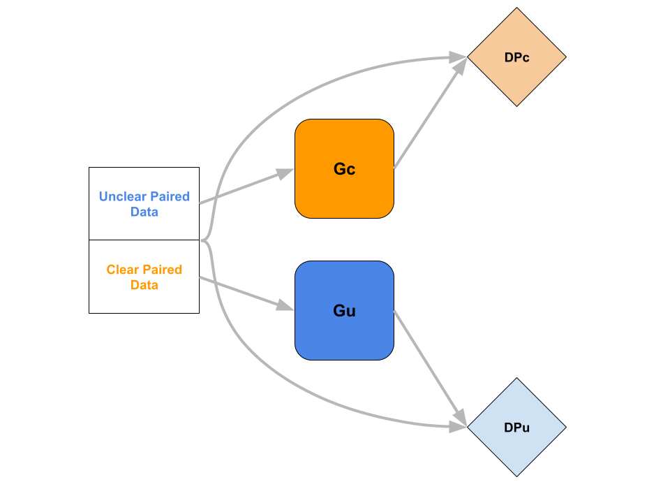
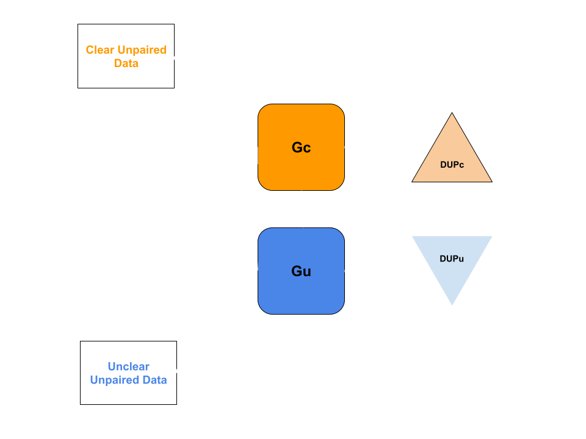
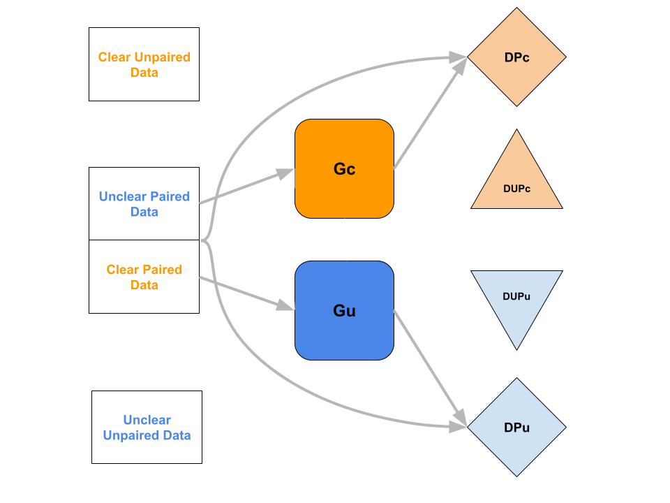
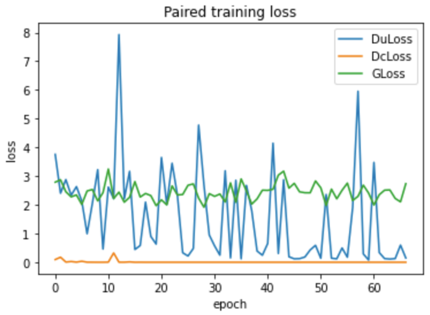
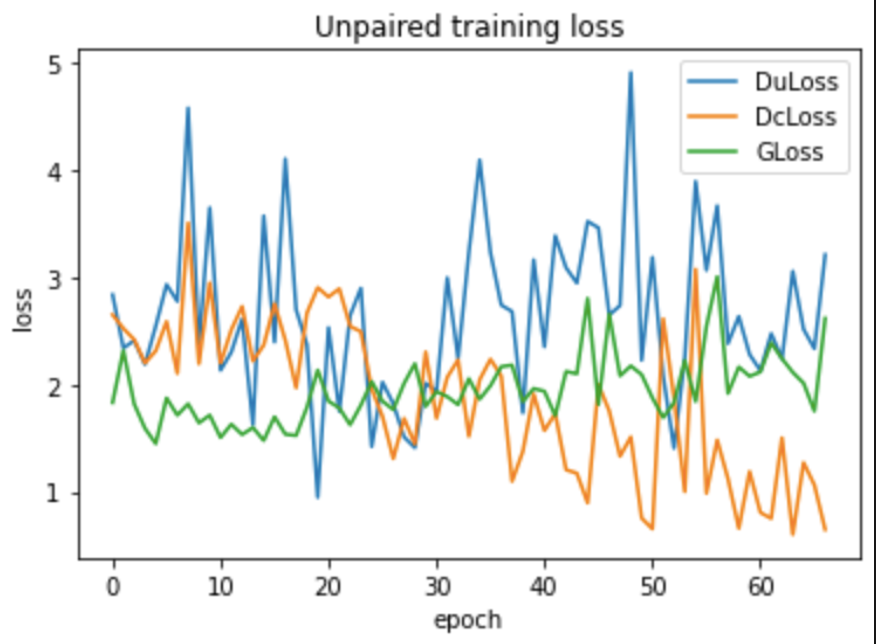

### Combined paired-unpaired GAN training for underwater image enhancement (UIE)
*[Sonia Cromp](https://github.com/soCromp), University of Wisconsin-Madison Computer Sciences*    
See [here](resource/cromp_cv_proposal.pdf) for the proposal and [here](resource/cv_midreport.pdf) for the midterm report.

## Introduction

Underwater image enhancement (UIE) is the problem of improving the visual quality of images, from the color to the clarity and sharpness. UIE has a broad range of applications, from archaeological and biological research to sunken ship recovery. However, UIE also faces several challenges. It is difficult to obtain large datasets required to train typical state-of-the-art machine learning models, and a dataset dedicated to one location (such as the Mariana trench) may not generalize well to other locations (such as a shallow lake).  

One line of prior work focuses on applying unpaired learning techniques to UIE. In a typical, paired UIE learning regime, one trains a model to translate from an unclear image to a clear image using a dataset consisting of *n* unclear images and their corresponding *n* clear images that have been manually enhanced. In unpaired learning, techniques are designed to learn from a dataset of *n* unclear images and a seperate dataset of *m* clear images. In this way, the model learns to the distinguishing characteristics of the source/unclear and the target/clear domains without any examples of one scene in both domains.

In the present work, I propose UW PUP GAN (UnderWater / University of Wisconsin) Paired-or-UnPaired Generative Adversarial Network, which fuses paired and unpaired learning techniques. The anticipated use-case is a situation where relatively large quantities of unpaired unclear and clear examples are available, along with a smaller paired dataset. For instance, perhaps a research group has a limited time or budget to manually enhance a small number of unclear images and wishes to aid the learning of this dataset with unpaired images. To my knowledge, this is the first UIE work to combine paired and unpaired learning.

UW PUP GAN is inspired by a combination of the paired and unpaired versions of FUnIE-GAN, which in turn also draws inspiration from CycleGAN. In the procress of this project, I created a PyTorch implementation of FUnIE-GAN that is available here LINK.

## Approach
Overview of the paired training regime:  

Paired training consists of four components:  
- **Gc**, which learns to generate a clear image when given an unclear input image,  
- **Gu**, which learns to generate an unclear image when given a clear input image,  
- **DPc**, which takes as input a (clear, unclear) image pair and learns to distinguish whether the clear image was generated by Gc or manually enhanced and  
- **DPc**, which takes as input a (unclear, clear) image pair and learns to distinguish whether the unclear image was generated by Gc or pulled from the real dataset.    

Overview of the unpaired training regime:  

Unpaired training replaces DPc and DPu with DUPc and DUPu. DUPc takes as input a clear image and learns to distinguish whether the image is drawn from the clear dataset or generated by Gc. DUPu performs an analagous task for unclear images.  
Three types of loss functions are involved in the unpaired regime:  
- **GAN loss** is the traditional loss, where the discriminator is rewarded for guessing image source correctly and the generator is rewarded for fooling the discriminator,  
- **ID loss** inputs a clear image to Gc and an unclear image to Gu. The generated images should ideally be identical to the input images and  
- **Cycle loss** is inspired by CycleGAN. A clear image is given to Gu, generating a fake unclear image which is given to Gc to create a doubly fake clear image. The difference between the real and double fake clear image is minimized. A similar function is performed for the unclear images.    

Combining paired and unpaired:  

The paired and unpaired regimes are combined to create a model with three datasets (one paired, an unpaired clear and unpaired unclear) and six model components. Any given epoch may be specified as conducting either paired or unpaired training.

## Experiments

I experiment with training under a solely paired or unpaired regime, with alternating between epochs and with a paired/unpaired learning scheme that evolves over time. Specifically, for the evolving learning scheme, all epochs start as paired training. Gradually, the probability of unpaired epochs increases until there is a 50% of unpaired learning halfway through the total number of epochs (200) and a 100% chance of unpaired learning at the last epoch. For the *i*-th epoch out out *T* epochs total, I draw one sample from a binomial distribution with *i/T* probability of success.  
I also evaluated the paired, alternating and evolving schemes with a paired dataset containing 1000, 5000 or the full 11,000 examples. The employed dataset is EUVP CITE.    

The training logs looked as follows:

In the paired regime, I always encountered an issue where the paired clear discriminator DPc hit near-zero loss. I was unsure as how to rectify this issue, but a solution may provide more stable training and better results. The evolutions of the other components' losses appear relatively typical for adversarial training, where improvements in one component pose challenges for the adversarial component.

## Results
Here are several images from the alternating scheme and a paired dataset of just 1000 examples (top row is unclear and bottom row is the generated clear image):

## Future work

While there are some metrics for quantitatively assessing image quality in paired learning regimes, none to-date are seemingly designed for the unpaired regime. As such, the development of a metric that works for models trained with paired and/or unpaired data may aid progress in this line of research.

**Acknowledgement**: Thank you to the [Wisconsin Applied Computing Center](https://wacc.wisc.edu/)'s Euler Cluster and its administrator, Colin Vanden Heuvel, for compute resources!

## Sources
